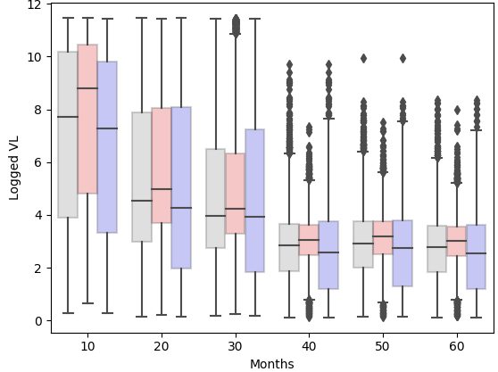

# Synthetic Data in the Classroom (HDAT9800 & HDAT9510 at UNSW)

Data viusalisation from HDAT course, see more in our [JMIR Medical Education paper](https://mededu.jmir.org/2024/1/e51388/). 
*Master of Science in Health Data Science — UNSW Sydney*

---

## Overview

At UNSW Sydney, synthetic data has become a core teaching resource for the Master of Science in Health Data Science program. 
Beyond its use in datathons and research prototyping, the [Health Gym synthetic datasets](https://github.com/NicKuo-ResearchStuff/Health_Gym_AI) now support two major postgraduate courses:
* [HDAT9800](https://www.handbook.unsw.edu.au/postgraduate/courses/2024/hdat9800) — Visualisation & Communication of Health Data
* [HDAT9510](https://www.handbook.unsw.edu.au/postgraduate/courses/2021/hdat9510) — Health Data Analytics: Machine Learning II

These courses sit at different ends of the data science skill spectrum -- one focused on communication and transparency, the other on cutting-edge machine learning.  
Yet both share one challenge:
real clinical data is often inaccessible, messy, and privacy-restricted.

Synthetic data solves this problem, providing students with realistic, mixed-type, longitudinal datasets without requiring ethics, clearances, or on-site supervision.

---

## HDAT9800 — Visualisation & Communication of Health Data

HDAT9800 trains future health data scientists to explain complex ideas clearly, using data visualisation as a bridge between technical detail and audience understanding.

The course introduces:
* transparent and reproducible analysis workflows
* R and Python for best-practice visualisation
* principles of perceptual design and accessibility
* communication for mixed audiences (clinicians, policymakers, public)

The Health Gym ART for HIV dataset gives students a rich, longitudinal dataset to explore. 
For instance, it helps student learn the [unsupervised learning technique of t-SNE](https://scikit-learn.org/stable/modules/generated/sklearn.manifold.TSNE.html), to showing how demographics, lab markers, and treatment dynamics cluster over time.

---

## HDAT9510 — Machine Learning II

HDAT9510 extends beyond foundational ML into advanced modern methods (*i.e.,* with [PyTorch](https://pytorch.org/)) used in real-world health analytics.

| **HDAT9510 Skill / Competency**          | **What Students Learn**                                                                   | **Synthetic Data Feature That Enables It**                                                                                   |
| ---------------------------------------- | ----------------------------------------------------------------------------------------- | ---------------------------------------------------------------------------------------------------------------------------- |
| **Deep Learning (CNNs, AEs)**            | Building non-linear feature extractors; representation learning                           | Rich mix of **numerical + categorical + binary** variables that require dimensionality reduction and learned representations |
| **Recurrent Neural Networks (LSTM/GRU)** | Modelling temporal dependencies and patient trajectories                                  | **60-month longitudinal** data per patient, with repeated measurements and evolving states                                   |
| **Reinforcement Learning**               | Mapping states → actions; treatment sequencing; policy optimisation                       | **Sequential regimen changes**, VL/CD4 dynamics, and reward-compatible clinical trajectories                                 |
| **Embedding Categorical Variables**      | Turning high-cardinality ART regimen codes into dense vector spaces                       | **Multiple categorical regimens** (Base Drug Combo, Comp INI, Comp NNRTI, Extra PI, pk-En) naturally require embeddings      |
| **Time-Series Modelling**                | Handling irregular sampling, trend detection,  and lag structures                          | **Irregular measurement patterns** (VL/CD4 measured at different times) reflect true clinical sampling                       |
| **Handling Missing Data**                | Making modelling assumptions; applying imputation or masking strategies                   | Realistic **missingness patterns** inherited from EuResist and MIMIC-III (measurement flags provided)                        |
| **Interpreting Mixed-Type Inputs**       | Integrating numerical, binary, categorical, and temporal inputs into unified ML pipelines | Full mix of **longitudinal variables** with heterogeneous data types                                                      |
| **Clinical Translation of ML Outputs**   | Relating model predictions to health outcomes and treatment pathways                      | **Clinically meaningful variables** (VL, CD4, regimen switches, suppression events) enable genuine interpretation            |

---

## Why It Matters

These synthetic datasets elevate the course by enabling students to practice:
* constructing sub-cohorts
* communicating uncertainty and variability
* exploring missingness patterns
* creating reproducible analytic workflows

All without exposing real patient records.

\- Nic

(Last updated: 2025-11-18)
